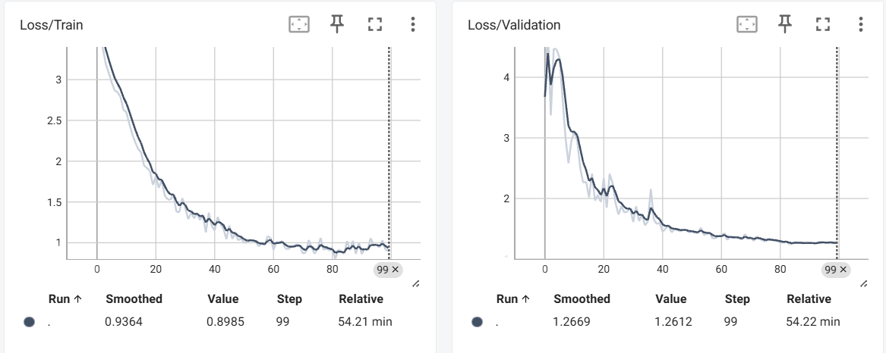
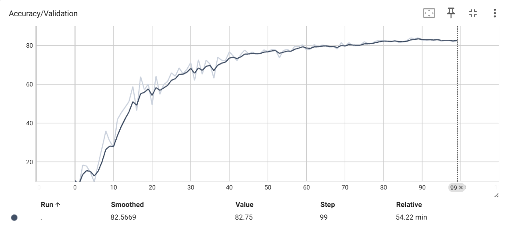
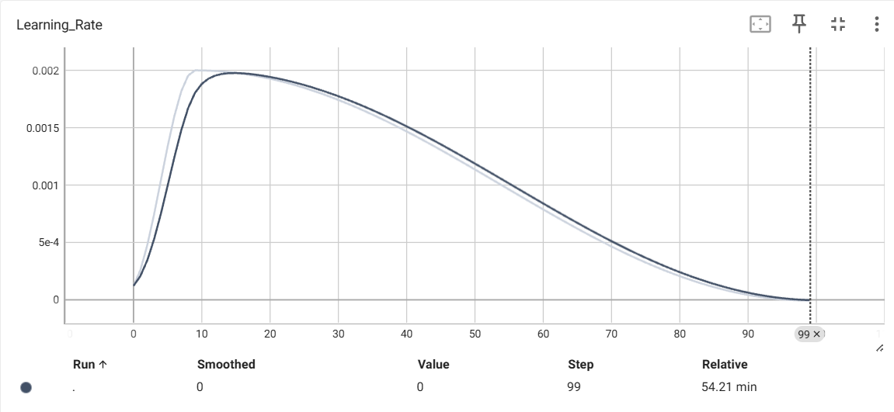

This project implements a **deep learning pipeline** for classifying environmental sounds using the [ESC-50 dataset](https://github.com/karoldvl/ESC-50). It combines a custom **ResNet-style CNN architecture** with a training pipeline that leverages modern audio preprocessing and augmentation techniques.

## Architecture

* **Input** : Mono mel-spectrograms
* **Stem** : 7×7 conv → BN → ReLU → 3×3 max-pool

  **Residual Stages** :
* Layer 1: 3 blocks, 64 filters
* Layer 2: 4 blocks, 128 filters (downsampling at start)
* Layer 3: 6 blocks, 256 filters (downsampling at start)
* Layer 4: 3 blocks, 512 filters (downsampling at start)
* **Head** : Adaptive avg pooling → Dropout (0.5) → Fully connected layer (50 classes)

Each **ResidualBlock** uses two 3×3 conv layers with batch normalization and a skip connection (identity or 1×1 conv for dimension match).

## Hyperparameters

### Dataset / Audio

- Sample rate: `22050`
- STFT `n_fft`: `1024`
- Hop length: `512`
- Mel bins: `128`
- Mel `f_max`: `11025`

### Training

- Batch size: `32`
- Epochs: `100`
- Optimizer: `AdamW` (LR = `5e-4`, weight decay = `0.01`)
- Scheduler: `OneCycleLR` (max_lr = `2e-3`, `pct_start` = `0.1`)
- Loss: `CrossEntropyLoss` with label smoothing `0.1`
- Dropout (before FC): `0.5`

### Augmentation & Regularization

- Mixup: Beta(`0.2`, `0.2`) applied ~30% of batches
- Frequency masking: `freq_mask_param=30`
- Time masking: `time_mask_param=80`

## Results & graphs

### Losses

This graph shows the model's loss decreasing over time for both the training and validation datasets. The loss value indicates how well the model is performing, with a lower value being better. A steady decrease suggests the model is learning effectively without significant issues like overfitting or underfitting.



### Accuracy over Validation

This graph plots the model's accuracy on the validation dataset as training progresses. Accuracy measures the percentage of correct predictions. The upward trend in the curve indicates that the model's performance is improving over time, with the model reaching best accuracy of 84% by the end of training.



### Learning rate

This graph shows how the learning rate changed during the training process. The learning rate controls how much the model's weights are adjusted in response to the estimated error each time the model's weights are updated. The curve shows a typical learning rate schedule, where the rate increases at the beginning (warm-up) and then gradually decreases to help the model converge more smoothly.



## Setup

Follow these steps to install and set up the project.

### Clone the Repository

```bash
clone https://github.com/youssefezzat304/cnn-audio-analyzer.git
```

### Backend

Navigate to the folder

```bash
cd cnn-audio-analyzer

```

Install dependencies

```bash
pip install -r requirements.txt
```

Modal setup

```bash
modal setup
```

Run on Modal

```
modal run main.py
```

Deploy backend

```
modal deploy main.py
```

### Frontend

install dependencies

```bash
cd frontend
npm i
```

run

```bash
npm run dev
```

## Credits

This project is based on and modified from the work by [Andreaswt](https://github.com/Andreaswt).

**[Original Repository.](https://github.com/Andreaswt/audio-cnn)**
