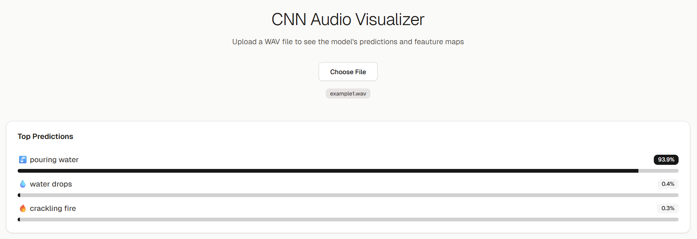
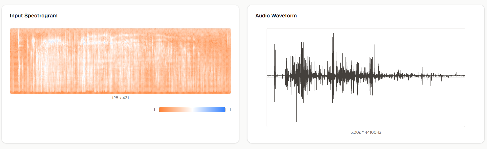

## What to Expect After Uploading a File

After you select a `.wav` audio file, the CNN Audio Visualizer will process it and display a comprehensive analysis. Here’s a breakdown of the results you will see.

### 1. Start by Uploading a File

The initial interface is simple. Click the **"Choose File"** button to select a local `.wav` file from your computer.

### 2. View the Model's Predictions

Once the file is processed, the first thing you'll see is the model's classification of the sound. The **Top Predictions** section shows a ranked list of the most likely sound categories, along with a confidence score for each.

### 3. Analyze the Input Audio

Below the predictions, the application displays visualizations of the input sound file itself:

* **Input Spectrogram:** This is a visual representation of the spectrum of frequencies in the audio as they vary with time. This spectrogram is the actual data fed into the neural network.
* **Audio Waveform:** This is the standard representation of the audio signal, showing its amplitude over time.

### 4. Explore the Neural Network's Internal Layers

For a deeper look into how the model "thinks," the **Convolutional Layer Outputs** section visualizes the feature maps at different stages of the network.

* You can see how the representation of the audio becomes more abstract as it passes from the initial layers (`layer1`) to the deeper layers (`layer4`).
* Each layer's view can be expanded to inspect the outputs of its specific sub-components, such as the convolution (`conv`) and ReLU activation (`relu`) steps. This allows you to see the features the network learns to detect at each stage.

